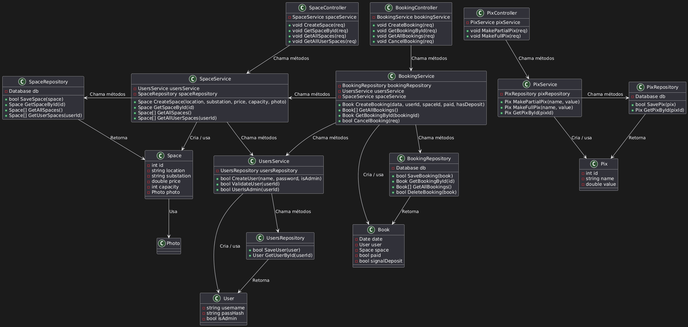
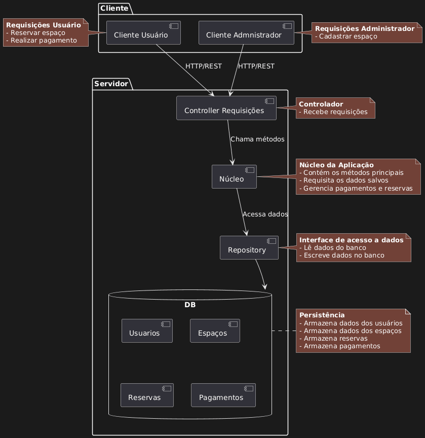

# Seu Cantinho 🏠 📊
## Disciplina: Design de Software 🖥️
👥 Alunos:

| Nome | GRR |
|------|-----|
|Davi Campos Ribeiro |20232378|
|Giovanna Fioravante Dalledone |20232370|
|Vinícius Jeremias dos Santos |20232361|

🗣️ Linguagem: GO

## 1. 🏛️ Arquitetura Proposta: Cliente-Servidor em Camadas
O estilo arquitetural escolhido para a implementação das funcionalidades do sistema **SeuCantinho** foi: `Cliente-Servidor em Camadas`. A escolha foi feita com base na proposta das ações que deveriam ser disponibilizadas pelo sistema e, além disso, separar o usuário da aplicação mostrou-se uma ótima forma de organização.

### 🌐 1.1 Funcionalidades do Sistema:
Existem **dois** tipos de usuário:
- **Usuário Comum** - Não tem acesso a todos os dados do sistema.
- **Administrador** - Tem acesso ao sistema por completo.

Como já demonstrado, cada tipo de usuário possui ações distintas:

🤖 **Administrador:**

0. `Encerrar Execução`
1. `Criar Espaço`
2. `Atualizar Espaço`
3. `Obter Espaço`
4. `Obter Todos os Espaços`
5. `Deletar Espaço`
6. `Obter Usuário`
7. `Obter Todos os Usuários`
8. `Fazer Reserva`
9. `Obter Reserva`
10. `Minhas Reservas`
11. `Obter Todas as Reservas`
12. `Pagar Reserva`
13. `Cancelar Reserva`

👤 **Usuário Comum:**

0. `Encerrar Execução`
1. `Obter Espaço`
2. `Obter Todos os Espaços`
3. `Fazer Reserva`
4. `Obter Reserva`
5. `Minhas Reservas`
6. `Obter Todas as Reservas`
7. `Pagar Reserva`
8. `Cancelar Reserva`

### 📂 1.2 Organização dos Arquivos
Para respeitar o estilo arquitetural escolhido, a organização dos arquivos foi a seguinte:

```bash
├── client
│   ├── cmd
│   │   └── client
│   │       └── main.go
│   ├── Dockerfile
│   ├── go.mod
│   └── internal
│       ├── bookings.go
│       ├── login.go
│       ├── session.go
│       ├── spaces.go
│       └── user.go
├── data  [error opening dir]
├── diagrams
│   ├── classes.png
│   ├── Classes_SeuCantinho.uml
│   ├── Componentes_SeuCantinho.uml
│   └── cscomponentes.png
├── docker-compose.yml
├── go.mod
├── go.sum
├── README.md
├── Relatorio.md
└── server
    ├── cmd
    │   └── server
    │       └── main.go
    ├── Dockerfile
    ├── docs
    │   ├── docs.go
    │   ├── swagger.json
    │   └── swagger.yaml
    ├── go.mod
    ├── go.sum
    ├── internal
    │   ├── controller
    │   │   ├── bookings
    │   │   │   ├── BookingController.go
    │   │   │   ├── BookSpace.go
    │   │   │   ├── CancelBookingById.go
    │   │   │   ├── GetAllBookings.go
    │   │   │   ├── GetBookingById.go
    │   │   │   └── GetUserBookings.go
    │   │   ├── payments
    │   │   │   ├── GetPaymentById.go
    │   │   │   ├── MakePayment.go
    │   │   │   └── PaymentsController.go
    │   │   ├── space
    │   │   │   ├── CreateSpace.go
    │   │   │   ├── DeleteSpace.go
    │   │   │   ├── GetAllSpaces.go
    │   │   │   ├── GetSpaceById.go
    │   │   │   ├── SpaceController.go
    │   │   │   └── UpdateSpace.go
    │   │   └── users
    │   │       ├── CreateUser.go
    │   │       ├── GetAllUsers.go
    │   │       ├── GetUserById.go
    │   │       ├── UserLogin.go
    │   │       └── UsersController.go
    │   ├── database
    │   │   └── database.go
    │   ├── models
    │   │   ├── bookings
    │   │   │   └── booking.go
    │   │   ├── error
    │   │   │   └── error.go
    │   │   ├── payments
    │   │   │   └── payment.go
    │   │   ├── space
    │   │   │   └── space.go
    │   │   └── users
    │   │       └── user.go
    │   ├── repository
    │   │   ├── bookings
    │   │   │   └── BookingsRepository.go
    │   │   ├── payments
    │   │   │   └── PaymentsRepository.go
    │   │   ├── space
    │   │   │   └── SpaceRepository.go
    │   │   └── users
    │   │       └── UsersRepository.go
    │   ├── routes
    │   │   └── routes.go
    │   └── services
    │       ├── bookings
    │       │   └── BookingsService.go
    │       ├── payments
    │       │   └── PaymentsService.go
    │       ├── space
    │       │   └── SpaceService.go
    │       └── users
    │           └── UsersService.go
    └── migrations
        └── init.sql
```

### 1.3 📲 Estilo Arquitetural de Comunicação: REST

A comunicação realizada entre o usuário e o **backend** do código é feita por meio da API REST. No contexto do sistema `SeuCantinho`, o arquivo com as rotas está localizado em `"/server/internal"`. Cada rota chama uma função implementada para cada ação possível de ser realizada.

## 2. Mapeamento UML

**Diagrama de Classes**


**Diagrama de Componentes**



**Decisões de Design**
- Os nomes dos arquivos são os nomes das classes.
- O cliente tem todas as suas ações reunidas em um mesmo diretório.
- O diretório `cmd` representa o `src` tanto no cliente quanto no servidor.

## 3. 🛠️ Instruções de Execução

**1. Garanta que seu computador tem o Swagger instalado:** 
Execute:
```bash
nmp install swagger-ui-express js-yaml
```
>Obs: Se você não possuir o comando `npm` instale-o com `sudo apt install npm`

>Obs2: Se o seu computador não possuir a versão mais recente da linguagem GO, realize os seguintes comandos: `wget https://go.dev/dl/go1.25.4.linux-amd64.tar.gz` e descompacte com `sudo tar -C /usr/local -xzf go1.25.4.linux-amd64.tar.gz`

>Obs3: **Talvez** possa ser necessário adicionar alguns PATHS no arquivo .bashrc em caso de ainda persistirem erros.

**2. Gerar a Documentação no formato Swagger**
No diretório `server` mais externo, execute:
```bash
swag init -g cmd/server/main.go
```

**3. Inicie o Docker**
No diretório raiz (`SeuCantinho`) suba o docker com o comando:
```bash
sudo docker compose up -d --build
```
Ele inicia o servidor e o cliente, o trecho `--build` não é obrigatório, ele serve para pegar a versão mais recente dos arquivos, vale ressaltar que o docker funciona muito sem ele também.

**4. Rode o Cliente**
No mesmo diretório do servidor, execute:
```bash
sudo docker compose exec client /app/client
```
E aproveite o sistema **SeuCantinho**!